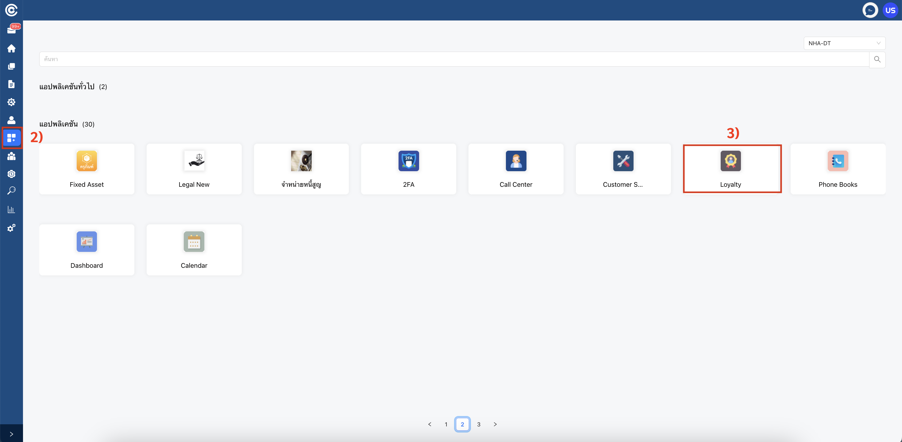
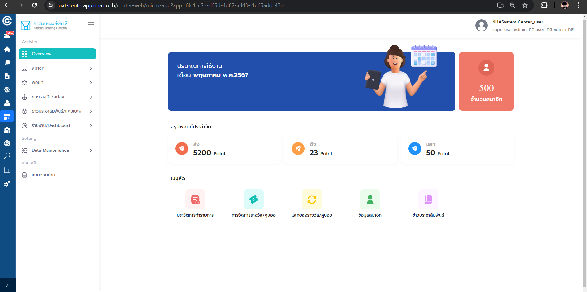
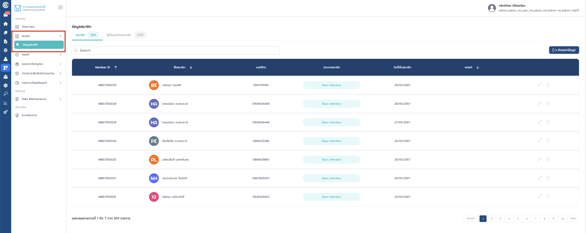
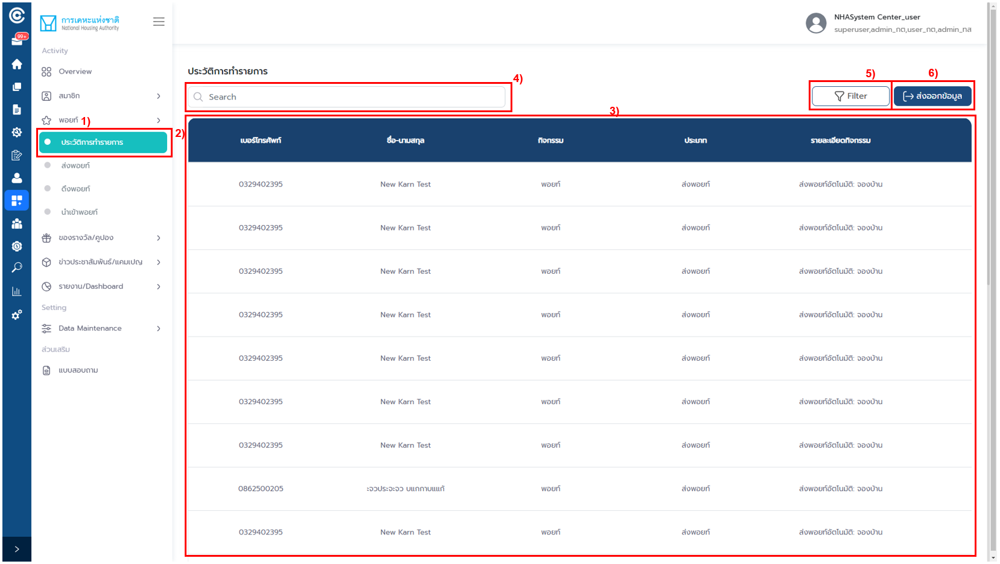
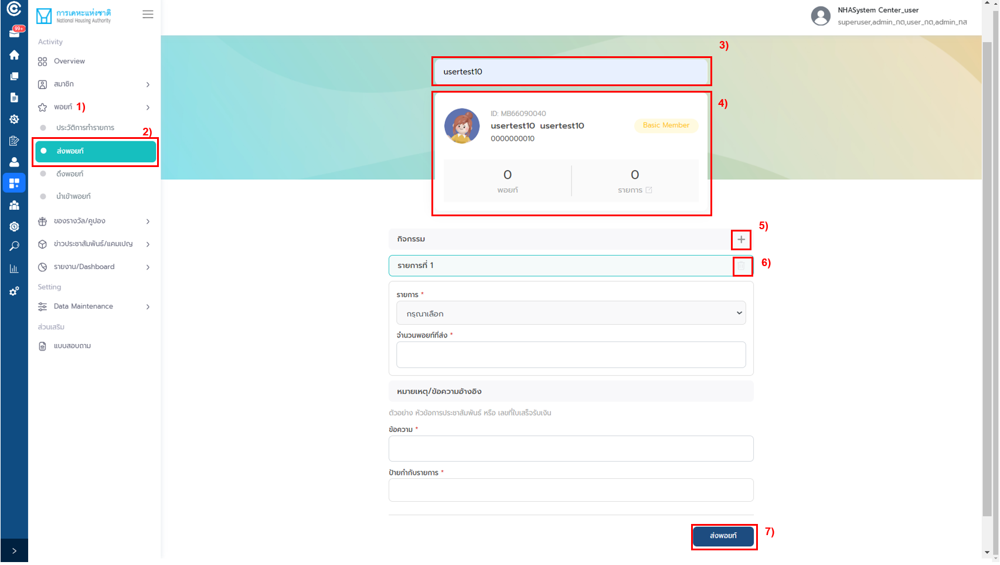
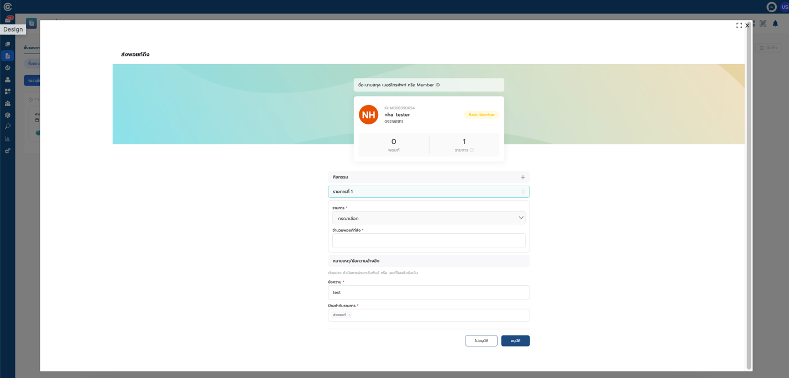
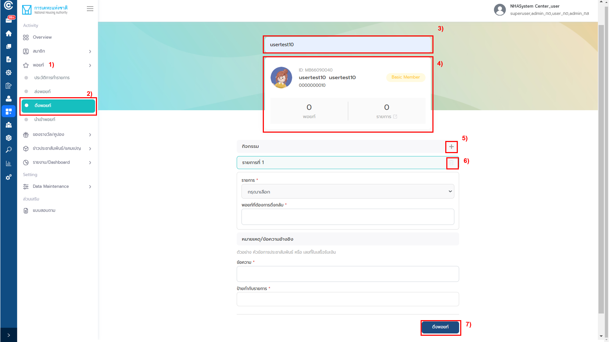
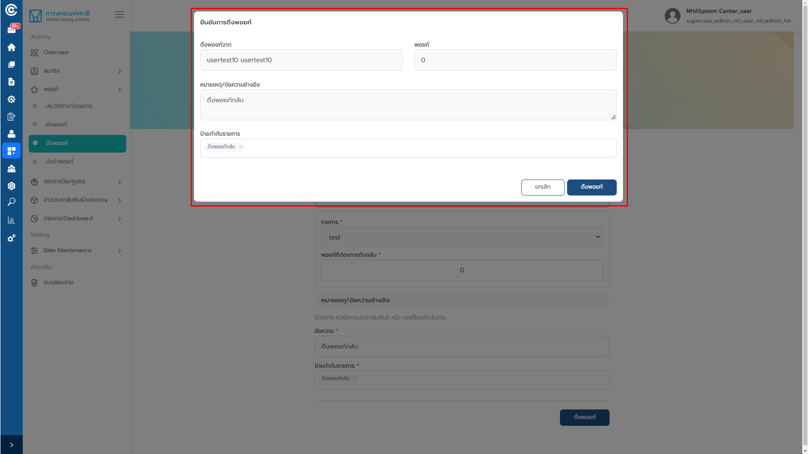

# ผู้ดูแลระบบ

## **บทที่ 1 วิธีการเข้าใช้งานแอปพลิเคชัน Loyalty**

#### **วิธีการเข้าใช้งานในส่วนของแอปพลิเคชัน Loyalty**

1. ไปที่ [centerapp.nha.co.th](https://uat-centerapp.nha.co.th/) จากนั้นเข้าสู่ระบบ
2. ไปที่ Navigation drawer แล้วคลิก “แอปพลิเคชันของฉัน”
3. คลิก “Loyalty”

## **บทที่ 2 การใช้งานในส่วนของเมนู Activity**

การใช้งานในส่วนของเมนู Activity จะประกอบไปด้วย 4 เมนูหลัก ดังต่อไปนี้

### 2.1 Overview

ผู้ใช้งานสามารถดูข้อมูลภาพรวม ปริมาณการใช้งานของเดือนปัจจุบัน จำนวนสมาชิก สรุปพอยท์ประจำวัน อีกทั้งยังสามารถใช้งาน เมนูลัด เพื่อไปยังเมนูต่างๆ ได้จากหน้านี้

#### **วิธีการเข้าใช้งานในส่วนของเมนู Overview**

1. ไปที่แอปพลิเคชัน “Loyalty”
2. คลิกเมนู “Overview”

### 2.2 สมาชิก

ผู้ใช้งานสามารถบริหารจัดการข้อมูลสมาชิก และดูข้อมูลบัตรสมาชิก

#### **วิธีการเข้าใช้งานในส่วนของเมนู สมาชิก**

1. ไปที่แอปพลิเคชัน “Loyalty”
2. คลิกเมนู “สมาชิก”

#### **2.2.1 ข้อมูลสมาชิก**

ผู้ใช้งานสามารถบริหารจัดการสมาชิก และผู้ที่รอสมัครสมาชิก โดยจะต้องมีสิทธิ์เป็นผู้ดูแล จึงจะสามารถบริหารจัดการข้อมูลสมาชิกได้

* การบริหารจัดการสมาชิก

ผู้ใช้งานสามารถบริการจัดการสมาชิกโดย ค้นหาข้อมูลสมาชิก ดูรายละเอียดบัตรสมาชิก ส่งออกข้อมูล แก้ไขข้อมูลบัตรสมาชิก และลบข้อมูลสมาชิกได้

**วิธีการบริหารจัดการสมาชิก**

1. ไปที่เมนู “สมาชิก”
2. คลิก “ข้อมูลสมาชิก”
3. คลิกแท็บ “สมาชิก”
4. ผู้ใช้งานสามารถดูรายละเอียดบัตรสมาชิกได้ที่ “ตารางรายการสมาชิก” จากนั้นคลิกรายการสมาชิกที่ต้องการ ระบบจะแสดงหน้าป๊อปอัพ “ข้อมูลบัตรสมาชิก”
5. ผู้ใช้งานสามารถค้นหาข้อมูลสมาชิก โดยระบุข้อมูลที่ต้องการค้นหาได้ที่ “ช่องค้นหา”
6. ผู้ใช้งานสามารถแก้ไขข้อมูลบัตรสมาชิก โดยคลิก “ไอคอนดินสอ” ระบบจะแสดงหน้าข้อมูลบัตรสมาชิก สามารถแก้ไขรูปโปรไฟล์บนบัตรสมาชิก ประเภทบัตรสมาชิก ชื่อ นามสกุล วันเกิด เบอร์โทรศัพท์ และสามารถตั้งค่าการเปิด (active) /ปิด (Inactive) การใช้งานบัตรสมาชิกได้
7. ผู้ใช้งานสามารถยกเลิกบัตรสมาชิก โดยคลิก “ไอคอนถังขยะ”
8. ผู้ใช้งานสามารถส่งออกข้อมูลสมาชิก โดยคลิกปุ่ม “ส่งออกข้อมูล”

* การบริหารจัดการผู้ที่รอสมัครสมาชิก

ผู้ใช้งานสามารถ ค้นหาข้อมูลผู้ที่รอสมัครสมาชิก ส่งออกข้อมูลผู้ที่รอสมัครสมาชิก ดูข้อมูลผู้ที่รอสมัครสมาชิกได้

**วิธีการบริหารจัดการผู้ที่รอสมัครสมาชิก**

1. ไปที่เมนู “สมาชิก”
2. คลิก “ข้อมูลสมาชิก”
3. คลิกแท็บ “ผู้ที่รอสมัครสมาชิก”
4. ผู้ใช้งานสามารถดูรายละเอียดข้อมูลผู้ที่รอสมัครสมาชิกได้ที่ “ตารางผู้ที่รอสมัครสมาชิก” จากนั้นคลิกรายการผู้ที่รอสมัครสมาชิกที่ต้องการ ระบบจะแสดงหน้าป๊อปอัพ “ข้อมูลผู้ที่รอสมัครสมาชิก”
5. ผู้ใช้งานสามารถค้นหาข้อมูลผู้ที่รอสมัครสมาชิก โดยระบุข้อมูลที่ต้องการค้นหาได้ที่ “ช่องค้นหา”
6. ผู้ใช้งานสามารถส่งออกข้อมูลผู้ที่รอสมัครสมาชิก โดยคลิกปุ่ม “ส่งออกข้อมูล”

<figure><figcaption>
<strong>รูปภาพที่ 5</strong> หน้าจอแสดงข้อมูลสมาชิก - การบริหารจัดการข้อมูลผู้ที่รอสมัครสมาชิก
</figcaption></figure>

### 2.3 พอยท์

ผู้ใช้งานสามารถบริหารจัดการพอยท์ ดูประวัติการทำรายการ ส่งพอยท์ ดึงพอยท์ และนำเข้าพอยท์ โดยจะต้องมีสิทธิ์เป็นผู้ดูแล จึงจะสามารถบริหารจัดการพอยท์ได้

#### **2.3.1 ประวัติการทำรายการ**

**วิธีการดูประวัติการทำรายการ**

1. ไปที่เมนู “พอยท์”
2. คลิก “ประวัติการทำรายการ”
3. ผู้ใช้งานสามารถดูประวัติการทำรายการได้ที่ “ตารางประวัติการทำรายการ”
4. ผู้ใช้งานสามารถค้นหาประวัติการทำรายการ โดยระบุข้อมูลที่ต้องการค้นหาได้ที่ “ช่องค้นหา”
5. ผู้ใช้งานสามารถใช้ตัวกรอง โดยคลิกปุ่ม “Filter” สามารถกรอง ช่วงเวลา กิจกรรม และประเภทได้
6. ผู้ใช้งานสามารถส่งออกข้อมูลประวัติการทำรายการ โดยคลิกปุ่ม “ส่งออกข้อมูล”

#### **2.3.2 ส่งพอยท์**

**วิธีการส่งพอยท์**

1. ไปที่เมนู “พอยท์”
2. คลิก “ส่งพอยท์”
3. ผู้ใช้งานสามารถค้นหา ชื่อ-นามสกุล เบอร์โทรศัพท์ หรือ Member ID ของลูกค้าได้ โดยระบุข้อมูลที่ต้องการค้นหาได้ที่ “ช่องค้นหา” จากนั้นระบบจะแสดงรายละเอียดข้อมูลสมาชิก ในกรณีที่พบว่าผลการค้นหามีมากกว่า 1 รายการ ระบบจะแสดงหน้าป๊อปอัพ ผลการค้นหารายการสมาชิก ผู้ใช้งานสามารถเลือกชื่อสมาชิกที่ต้องการได้
4. ผู้ใช้งานสามารถดูรายละเอียดข้อมูลสมาชิกที่จะส่งพอยท์ให้ ดังนี้
   * Member ID
   * ชื่อนามสกุล
   * เบอร์โทรศัพท์
   * ประเภทบัตรสมาชิก
   * จำนวนพอยท์
   * รายการล่าสุด สามารถคลิกที่ “ไอคอน” เพื่อดูรายละเอียดรายการเพิ่มเติมได้
5. ผู้ใช้งานสามารถเพิ่มรายการกิจกรรมได้ โดยคลิกที่ “ไอคอน +”
6. ผู้ใช้งานสามารถลบรายการกิจกรรมได้ โดยคลิกที่ “ไอคอนถังขยะ”
7. ผู้ใช้งานกรอกรายละเอียดการส่งพอยท์ จากนั้นคลิกปุ่ม “ส่งพอยท์” ระบบจะแสดงหน้าป๊อบอัพ ยืนยันการส่งพอยท์ จากนั้นตรวจสอบความถูกต้องอีกครั้งแล้วคลิกปุ่ม “ส่งพอยท์” ในกรณีที่ต้องการยกเลิก คลิกปุ่ม “ยกเลิก”
8. เมื่อทำการส่งพอยท์แล้ว
   * ระบบจะส่งรายการดำเนินการไปที่ระบบมอบหมายงาน จากนั้นผู้ใช้งานจะต้องทำการเปิดงาน โดยการคลิกปุ่ม “ดำเนินงาน” และรอการอนุมัติ เมื่อได้รับการอนุมัติแล้ว ระบบจะทำการแจ้งเตือนการอนุมัติสำเร็จไปยังผู้ทำรายการและลูกค้า
   * ระบบจะประมวลผลตามรายการดำเนินการ และแสดงรายการในหน้าประวัติการทำรายการ
9. ผู้ใช้งานสามารถตรวจสอบพอยท์ได้โดยคลิกเมนู “ประวัติการทำรายการ”

#### **2.3.3 ดึงพอยท์**

**วิธีการดึงพอยท์**

1. ไปที่เมนู “พอยท์”
2. คลิก “ดึงพอยท์”
3. ผู้ใช้งานสามารถค้นหา ชื่อ-นามสกุล เบอร์โทรศัพท์ หรือ Member ID ของลูกค้าได้ โดยระบุข้อมูลที่ต้องการค้นหาได้ที่ “ช่องค้นหา” จากนั้นระบบจะแสดงรายละเอียดข้อมูลสมาชิก ในกรณีที่พบว่าผลการค้นหามีมากกว่า 1 รายการ ระบบจะแสดงหน้าป๊อปอัพ ผลการค้นหารายการสมาชิก ผู้ใช้งานสามารถเลือกชื่อสมาชิกที่ต้องการได้
4. ผู้ใช้งานสามารถดูรายละเอียดข้อมูลสมาชิกที่จะดึงพอยท์ให้ ดังนี้
   * Member ID
   * ชื่อนามสกุล
   * เบอร์โทรศัพท์
   * ประเภทบัตรสมาชิก
   * จำนวนพอยท์
   * รายการล่าสุด สามารถคลิกที่ “ไอคอน” เพื่อดูรายละเอียดรายการเพิ่มเติมได้
5. ผู้ใช้งานสามารถเพิ่มรายการกิจกรรมได้ โดยคลิกที่ “ไอคอน +”
6. ผู้ใช้งานสามารถลบรายการกิจกรรมได้ โดยคลิกที่ “ไอคอนถังขยะ”
7. ผู้ใช้งานกรอกรายละเอียดการดึงพอยท์ จากนั้นคลิกปุ่ม “ดึงพอยท์” ระบบจะแสดงหน้าป๊อบอัพ ยืนยันการดึงพอยท์ จากนั้นตรวจสอบความถูกต้องอีกครั้งแล้วคลิกปุ่ม “ดึงพอยท์” ในกรณีที่ต้องการยกเลิก คลิกปุ่ม “ยกเลิก”
8. เมื่อทำการดึงพอยท์แล้ว
   * ระบบจะส่งรายการดำเนินการไปที่ระบบมอบหมายงาน จากนั้นผู้ใช้งานจะต้องทำการเปิดงาน โดยการคลิกปุ่ม “ดำเนินงาน” และรอการอนุมัติ เมื่อได้รับการอนุมัติแล้ว ระบบจะทำการแจ้งเตือนการอนุมัติสำเร็จไปยังผู้ทำรายการและลูกค้า
   * ระบบจะประมวลผลตามรายการดำเนินการ และแสดงรายการในหน้าประวัติการทำรายการ
9. ผู้ใช้งานสามารถตรวจสอบพอยท์ได้โดยคลิกเมนู “ประวัติการทำรายการ”

#### **2.3.4 นำเข้าพอยท์**

**วิธีการนำเข้าพอยท์**

1. ไปที่เมนู “พอยท์”
2. คลิก “นำเข้าพอยท์”
3. ผู้ใช้งานสามารถสร้าง/นำเข้าพอยท์ โดยคลิกปุ่ม “+ สร้าง/นำเข้างาน”
4. ไปที่ ตัวอย่างไฟล์ ผู้ใช้งานสามารถดาวน์โหลดตัวอย่างไฟล์มาทำการเพิ่มข้อมูลที่ต้องการนำเข้า โดยคลิก “ไอคอนดาวน์โหลด”
5. เมื่อทำการเพิ่มข้อมูลลงในไฟล์เรียบร้อยแล้ว ไปที่ สร้าง/นำเข้างาน จากนั้นอัปโหลดไฟล์ ระบบจะสร้างตารางการนำเข้าพอยท์ให้อัตโนมัติ
6. ผู้ใช้งานสามารถเลือกกำหนดเวลาในการนำเข้าข้อมูลได้ที่ “ตัวเลือกการนำเข้าข้อมูล”
7. คลิกปุ่ม “นำเข้า” เพื่อทำการนำเข้าพอยท์
8. ระบบแสดงหน้าสรุปข้อมูลการนำเข้า สถานะ รอดำเนินการ
9. จากนั้นไปที่ระบบมอบหมายงานเพื่อทำการเปิดงานและขออนุมัติ
10. เมื่อได้รับการอนุมัติเรียบร้อยแล้วผู้ใช้สามารถตรวจสอบการนำเข้าพอยท์ได้ที่ “ตารางนำเข้าพอยท์”

<figure><figcaption>
<strong>รูปภาพที่ 17</strong> หน้าจอแสดงวิธีการนำเข้าพอยท์ – สร้าง/นำเข้าพอยท์
</figcaption></figure>

<figure><figcaption>
<strong>รูปภาพที่ 18</strong> หน้าจอแสดงวิธีการนำเข้าพอยท์ – ดาวน์โหลดตัวอย่างไฟล์การนำเข้าพอยท์
</figcaption></figure>

<figure><figcaption>
<strong>รูปภาพที่ 19</strong> หน้าจอแสดงวิธีการนำเข้าพอยท์ – อัปโหลดเพื่อนำเข้าพอยท์
</figcaption></figure>

<figure><figcaption>
<strong>รูปภาพที่ 20</strong> หน้าจอแสดงวิธีการนำเข้าพอยท์ – ตัวเลือกการนำเข้าข้อมูล
</figcaption></figure>

<figure><figcaption>
<em><strong>รูปภาพที่ 21</strong> หน้าจอแสดงวิธีการนำเข้าพอยท์ –</em> สรุปข้อมูลการนำเข้า
</figcaption></figure>

<figure><figcaption>
<strong>รูปภาพที่ 22</strong> หน้าจอแสดงวิธีการนำเข้าพอยท์ – ระบบมอบหมายงาน
</figcaption></figure>

**รูปภาพที่ 23** หน้าจอแสดงวิธีการนำเข้าพอยท์ – ระบบมอบหมายงาน

**วิธีการดูรายการนำเข้าพอยท์**

1. ไปที่เมนู “พอยท์”
2. คลิก “นำเข้าพอยท์”
3. ผู้ใช้งานสามารถดูรายการนำเข้าพอยท์ได้ที่ “ตารางนำเข้าพอยท์”
4. ผู้ใช้งานสามารถค้นหาการนำเข้าพอยท์ โดยระบุข้อมูลที่ต้องการค้นหาได้ที่ “ช่องค้นหา”
5. ผู้ใช้งานสามารถใช้ตัวกรอง โดยคลิกปุ่ม “Filter” สามารถกรอง สถานะ ช่วงเวลาการเปลี่ยนแปลงล่าสุดได้

<figure><figcaption>
<strong>รูปภาพที่ 24</strong> หน้าจอแสดงการบริหารจัดการพอยท์ – วิธีการดูรายการนำเข้าพอยท์
</figcaption></figure>

<figure><figcaption>
<strong>รูปภาพที่ 25</strong> หน้าจอแสดงการบริหารจัดการพอยท์ – รายละเอียดรายการนำเข้าพอยท์
</figcaption></figure>

### **2.4 ของรางวัล/คูปอง**

ผู้ใช้งานสามารถบริหารจัดการของรางวัล/คูปอง แลกของรางวัล/คูปอง นำเข้าของรางวัล/คูปอง ประวัติการส่งของรางวัล/คูปอง

#### **2.4.1 ของรางวัล/คูปอง**

ผู้ใช้งานสามารถเพิ่ม ลบ แก้ไข ดูรายการของรางวัล/คูปอง และประวัติการแลกของรางวัลได้ โดยจะต้องมีสิทธิ์เป็นผู้ดูแล จึงจะสามารถบริหารจัดการของรางวัล/คูปองได้

**วิธีการเพิ่มของรางวัล/คูปอง**

1. ไปที่เมนู “ของรางวัล/คูปอง”
2. คลิก “ของรางวัล/คูปอง”
3. คลิกปุ่ม “เพิ่มของรางวัล/คูปอง”
4. ผู้ใช้งานกรอกข้อมูลของรางวัล/คูปอง จากนั้นคลิกปุ่ม “สร้าง”
5. ถ้าต้องการยกเลิกการเพิ่มของรางวัล/คูปอง คลิกปุ่ม “ยกเลิก”

<figure><figcaption>
<strong>รูปภาพที่ 26</strong> หน้าจอแสดงการบริหารจัดการของรางวัล/คูปอง – วิธีการเพิ่มของรางวัล/คูปอง
</figcaption></figure>

<figure><figcaption>
<strong>รูปภาพที่ 27</strong> หน้าจอแสดงการบริหารจัดการของรางวัล/คูปอง – วิธีการเพิ่มของรางวัล/คูปอง
</figcaption></figure>

<figure><figcaption>
<strong>รูปภาพที่ 28</strong> หน้าจอแสดงการบริหารจัดการของรางวัล/คูปอง – วิธีการยกเลิกการเพิ่มของรางวัล/คูปอง
</figcaption></figure>

**วิธีการลบข้อมูลของรางวัล/คูปอง**

1. ไปที่เมนู “ของรางวัล/คูปอง”
2. คลิก “ของรางวัล/คูปอง”
3. ผู้ใช้งานสามารถลบข้อมูลของรางวัล/คูปองได้ โดยคลิกที่ “ของรางวัล/คูปอง” ที่ต้องการลบ
4. ระบบจะแสดงหน้าข้อมูลของรางวัล/คูปอง
5. คลิกปุ่ม “ลบ”

<figure><figcaption>
<strong>รูปภาพที่ 29</strong> หน้าจอแสดงการบริหารจัดการของรางวัล/คูปอง – วิธีการลบของรางวัล/คูปอง
</figcaption></figure>

<figure><figcaption>
<strong>รูปภาพที่ 30</strong> หน้าจอแสดงการบริหารจัดการของรางวัล/คูปอง – วิธีการลบของรางวัล/คูปอง
</figcaption></figure>

**วิธีการแก้ไขข้อมูลของรางวัล/คูปอง**

1. ไปที่เมนู “ของรางวัล/คูปอง”
2. คลิก “ของรางวัล/คูปอง”
3. ผู้ใช้งานสามารถแก้ไขข้อมูลของรางวัล/คูปองได้ โดยคลิกที่ “ของรางวัล/คูปอง” ที่ต้องการแก้ไข
4. ระบบจะแสดงหน้าข้อมูลของรางวัล/คูปอง ผู้ใช้งานทำการแก้ไขข้อมูลของรางวัล/คูปอง
5. คลิกปุ่ม “แก้ไข”

<figure><figcaption>
<strong>รูปภาพที่ 31</strong> หน้าจอแสดงการบริหารจัดการของรางวัล/คูปอง – วิธีการแก้ไขข้อมูลของรางวัล/คูปอง
</figcaption></figure>

<figure><figcaption>
<strong>รูปภาพที่ 32</strong> หน้าจอแสดงการบริหารจัดการของรางวัล/คูปอง – วิธีการแก้ไขข้อมูลของรางวัล/คูปอง
</figcaption></figure>

**วิธีการดูรายการของรางวัล/คูปอง**

1. ไปที่เมนู “ของรางวัล/คูปอง”
2. คลิก “ของรางวัล/คูปอง”
3. ระบบจะแสดงหน้ารายการของรางวัล/คูปอง
4. ผู้ใช้งานสามารถค้นหาข้อมูลของรางวัล/คูปอง โดยระบุข้อมูลที่ต้องการค้นหาได้ที่ “ช่องค้นหา”
5. ผู้ใช้งานสามารถใช้ตัวกรอง โดยคลิกปุ่ม “Filter” สามารถกรอง ประเภทของรางวัล สถานะการใช้งาน และช่วงเวลาได้

<figure><figcaption>
<strong>รูปภาพที่ 33</strong> หน้าจอแสดงการบริหารจัดการของรางวัล/คูปอง – วิธีการดูรายการรางวัล/คูปอง
</figcaption></figure>

**วิธีการดูประวัติการแลกรางวัล/คูปอง**

1. ไปที่เมนู “ของรางวัล/คูปอง”
2. คลิก “ของรางวัล/คูปอง”
3. คลิกแท็บ “ประวัติการแลกของรางวัล/คูปอง”
4. ผู้ใช้งานสามารถดูประวัติการแลกของรางวัล/คูปอง ได้ที่ “ตารางรายการประวัติการแลกของรางวัล/คูปอง”
5. ผู้ใช้งานสามารถค้นหาข้อมูลของรางวัล/คูปอง โดยระบุข้อมูลที่ต้องการค้นหาได้ที่ “ช่องค้นหา”
6. ผู้ใช้งานสามารถใช้ตัวกรอง โดยคลิกปุ่ม “Filter” สามารถกรอง ประเภทของรางวัล สถานะการใช้งาน และช่วงเวลาได้
7. ผู้ใช้งานสามารถส่งออกข้อมูลของรางวัล/คูปอง โดยคลิกปุ่ม “ส่งออกข้อมูล”
8. ผู้ใช้งานสามารถเลือกรูปแบบไฟล์ส่งออกข้อมูล

<figure><figcaption>
<strong>รูปภาพที่ 34</strong> หน้าจอแสดงการบริหารจัดการของรางวัล/คูปอง – วิธีการดูประวัติการแลกรางวัล/คูปอง
</figcaption></figure>

<figure><figcaption>
<strong>รูปภาพที่ 35</strong> หน้าจอแสดงการบริหารจัดการของรางวัล/คูปอง – รูปแบบการส่งออกข้อมูล
</figcaption></figure>

#### **2.4.2 นำเข้าของรางวัล/คูปอง**

ผู้ใช้งานสามารถ นำเข้าของรางวัล/คูปอง และดูรายการนำเข้าของรางวัล/คูปอง โดยจะต้องมีสิทธิ์เป็นผู้ดูแล จึงจะสามารถบริหารจัดการของรางวัล/คูปองได้

**วิธีการนำเข้าของรางวัล/คูปอง**

1. ไปที่เมนู “ของรางวัล/คูปอง”
2. คลิก “นำเข้าของรางวัล/คูปอง”
3. คลิกปุ่ม “+ นำเข้าของรางวัล/คูปอง”
4. ไปที่ ตัวอย่างไฟล์ ผู้ใช้งานสามารถดาวน์โหลดตัวอย่างไฟล์มาทำการเพิ่มข้อมูลที่ต้องการนำเข้า โดยคลิก “ไอคอนดาวน์โหลด”
5. เมื่อทำการเพิ่มข้อมูลลงในไฟล์เรียบร้อยแล้ว ไปที่ สร้าง/นำเข้างาน คูปอง จากนั้นอัปโหลดไฟล์ ระบบจะสร้างตารางการนำเข้าคูปองให้อัตโนมัติ
6. คลิกปุ่ม “นำเข้า” เพื่อทำการนำเข้าคูปอง
7. ระบบแสดงหน้าสรุปข้อมูลการนำเข้า สถานะ รอดำเนินการ
8. จากนั้นไปที่ระบบมอบหมายงานเพื่อทำการเปิดงานและขออนุมัติ
9. เมื่อได้รับการอนุมัติเรียบร้อยแล้วผู้ใช้สามารถตรวจสอบการนำเข้าคูปองได้ที่ “ตารางนำเข้าคูปอง”

<figure><figcaption>
<strong>รูปภาพที่ 36</strong> หน้าจอแสดงการนำเข้าของรางวัล/คูปอง – นำเข้าของรางวัล/คูปอง
</figcaption></figure>

<figure><figcaption>
<strong>รูปภาพที่ 37</strong> หน้าจอแสดงการนำเข้าของรางวัล/คูปอง – นำเข้าของรางวัล/คูปอง
</figcaption></figure>

**วิธีการดูรายการนำเข้ารางวัล/คูปอง**

1. ไปที่เมนู “ของรางวัล/คูปอง”
2. คลิก “นำเข้ารางวัล/คูปอง”
3. ระบบจะแสดงหน้ารายการนำเข้ารางวัล
4. ผู้ใช้งานสามารถค้นหาข้อมูลรางวัล/คูปอง โดยระบุข้อมูลที่ต้องการค้นหาได้ที่ “ช่องค้นหา”
5. ผู้ใช้งานสามารถใช้ตัวกรอง โดยคลิกปุ่ม “Filter” สามารถกรอง สถานะ ช่วงเวลาการเปลี่ยนแปลงล่าสุดได้

<figure><figcaption>
<strong>รูปภาพที่ 38</strong> หน้าจอแสดงการนำเข้าของรางวัล/คูปอง – ดูรายการนำเข้ารางวัล/คูปอง
</figcaption></figure>

#### **2.4.3 ประวัติการส่งรางวัล/คูปอง**

ผู้ใช้งานสามารถดูประวัติการส่งรางวัล/คูปอง โดยจะต้องมีสิทธิ์เป็นผู้ดูแล จึงจะสามารถดูประวัติการส่งรางวัล/คูปองได้

**วิธีการดูประวัติการส่งรางวัล/คูปอง**

1. ไปที่เมนู “ของรางวัล/คูปอง”
2. คลิก “ประวัติการส่งรางวัล/คูปอง”
3. ผู้ใช้งานสามารถดูประวัติการทำรายการได้ที่ “ตารางประวัติการส่งรางวัล/คูปอง”
4. ผู้ใช้งานสามารถค้นหาประวัติการส่งรางวัล/คูปองโดยระบุข้อมูลที่ต้องการค้นหาได้ที่ “ช่องค้นหา”
5. ผู้ใช้งานสามารถใช้ตัวกรอง โดยคลิกปุ่ม “Filter” สามารถกรอง ช่วงเวลา หมวดหมู่ได้
6. ผู้ใช้งานสามารถส่งออกข้อมูลประวัติการส่งรางวัล/คูปอง โดยคลิกปุ่ม “ส่งออกข้อมูล”
7. ผู้ใช้งานสามารถเลือกรูปแบบการส่งออกข้อมูล

<figure><figcaption>
<strong>รูปภาพที่ 39</strong> หน้าจอแสดงประวัติการส่งรางวัล/คูปอง - วิธีการดูประวัติการส่งรางวัล/คูปอง
</figcaption></figure>

<figure><figcaption>
<strong>รูปภาพที่ 40</strong> หน้าจอแสดงประวัติการส่งรางวัล/คูปอง - เลือกรูปแบบการส่งออกข้อมูล
</figcaption></figure>

### 2.5 ข่าวประชาสัมพันธ์/แคมเปญ

ผู้ใช้งานสามารถบริหารจัดการแคมเปญ นำเข้าแคมเปญ ข่าวประชาสัมพันธ์ โดยจะต้องมีสิทธิ์เป็นผู้ดูแล จึงจะสามารถบริหารจัดการของรางวัล/คูปองได้

#### **2.5.1 แคมเปญ/กิจกรรม**

ผู้ใช้งานสามารถเพิ่มแคมเปและกิจกรรม ดูรายการแคมเปญและกิจกรรม เปิด/ปิดการใช้งานแคมเปญและกิจกรรมได้

**วิธีการเพิ่มแคมเปญ/กิจกรรม**

1. ไปที่เมนู “ข่าวประชาสัมพันธ์/แคมเปญ”
2. คลิก “แคมเปญ/กิจกรรม”
3. คลิกปุ่ม “+เพิ่มแคมเปญ/กิจกรรม”
4. ผู้ใช้งานเปิด/ปิด เพื่อเลือกสร้าง “แคมเปญ” หรือ “กิจกรรม”
5. ผู้ใช้งานกรอกข้อมูลแคมเปญหรือกิจกรรม จากนั้นคลิกปุ่ม “ใช้งาน”
6. ถ้าต้องการยกเลิกการเพิ่มแคมเปญ/กิจกรรม คลิกปุ่ม “ยกเลิก”

<figure><figcaption>
<strong>รูปภาพที่ 41</strong> หน้าจอข่าวประชาสัมพันธ์/แคมเปญ - วิธีการเพิ่มแคมเปญ
</figcaption></figure>

<figure><figcaption>
<strong>รูปภาพที่ 42</strong> หน้าจอข่าวประชาสัมพันธ์/แคมเปญ – วิธีการเพิ่มแคมเปญ
</figcaption></figure>

<figure><figcaption>
<strong>รูปภาพที่ 43</strong> หน้าจอข่าวประชาสัมพันธ์/แคมเปญ – วิธีการเพิ่มแคมเปญ
</figcaption></figure>

<figure><figcaption>
<strong>รูปภาพที่ 44</strong> หน้าจอข่าวประชาสัมพันธ์/แคมเปญ – วิธีการเพิ่มกิจกรรม
</figcaption></figure>

<figure><figcaption>
<strong>รูปภาพที่ 45</strong> หน้าจอข่าวประชาสัมพันธ์/แคมเปญ – วิธีการยกเลิกกิจกรรม
</figcaption></figure>

**วิธีการดูรายการแคมเปญ**

1. ไปที่เมนู “ข่าวประชาสัมพันธ์/แคมเปญ”
2. คลิก “แคมเปญ”
3. ผู้ใช้งานสามารถดูรายการแคมเปญได้
4. ผู้ใช้งานสามารถค้นหาแคมเปญ โดยระบุข้อมูลที่ต้องการค้นหาได้ที่ “ช่องค้นหา”

<figure><figcaption>
<strong>รูปภาพที่ 46</strong> หน้าจอข่าวประชาสัมพันธ์/แคมเปญ – วิธีการดูรายการแคมเปญ / กิจกรรม
</figcaption></figure>

**วิธีการเปิด/ปิดการใช้งานแคมเปญและกิจกรรม**

1. ไปที่เมนู “ข่าวประชาสัมพันธ์/แคมเปญ”
2. คลิก “แคมเปญ/กิจกรรม”
3. ผู้ใช้งานสามารถเปิด/ปิดการใช้งานแคมเปญได้ที่ปุ่ม “Active/Inactive”

<figure><figcaption>
<strong>รูปภาพที่ 47</strong> หน้าจอข่าวประชาสัมพันธ์/แคมเปญ - เปิด/ปิดการใช้งานแคมเปญและกิจกรรม
</figcaption></figure>

#### **2.5.2 นำเข้าแคมเปญ**

ผู้ใช้งานสามารถ นำเข้าแคมเปญ และดูรายการนำเข้าแคมเปญได้

**วิธีการนำเข้าแคมเปญ**

1. ไปที่เมนู “ข่าวประชาสัมพันธ์/แคมเปญ”
2. คลิกเมนู “นำเข้าแคมเปญ”
3. คลิกปุ่ม “+ นำเข้าแคมเปญ”
4. ไปที่ ตัวอย่างไฟล์ ผู้ใช้งานสามารถดาวน์โหลดตัวอย่างไฟล์มาทำการเพิ่มข้อมูลที่ต้องการนำเข้า โดยคลิก “ไอคอนดาวน์โหลด”
5. เมื่อทำการเพิ่มข้อมูลลงในไฟล์เรียบร้อยแล้ว ไปที่ สร้าง/นำเข้างาน แคมเปญ จากนั้นอัปโหลดไฟล์ ระบบจะสร้างตารางการนำเข้าแคมเปญให้อัตโนมัติ
6. คลิกปุ่ม “นำเข้า” เพื่อทำการนำเข้าแคมเปญ
7. ระบบแสดงหน้าสรุปข้อมูลการนำเข้า สถานะ รอดำเนินการ
8. จากนั้นไปที่ระบบมอบหมายงานเพื่อทำการเปิดงานและขออนุมัติ
9. เมื่อได้รับการอนุมัติเรียบร้อยแล้วผู้ใช้สามารถตรวจสอบการนำเข้าแคมเปญได้ที่ “ตารางนำเข้าแคมเปญ”

<figure><figcaption>
<strong>รูปภาพที่ 48</strong> หน้าจอข่าวประชาสัมพันธ์/แคมเปญ - นำเข้าแคมเปญ
</figcaption></figure>

<figure><figcaption>
<strong>รูปภาพที่ 49</strong> หน้าจอข่าวประชาสัมพันธ์/แคมเปญ - นำเข้าแคมเปญ
</figcaption></figure>

**วิธีการดูรายการนำเข้าแคมเปญ**

1. ไปที่เมนู “ของข่าวประชาสัมพันธ์/แคมเปญ”
2. คลิก “นำเข้าแคมเปญ”
3. ระบบจะแสดงหน้ารายการนำเข้าแคมเปญ
4. ผู้ใช้งานสามารถค้นหารายการนำเข้าแคมเปญ โดยระบุข้อมูลที่ต้องการค้นหาได้ที่ “ช่องค้นหา”
5. ผู้ใช้งานสามารถใช้ตัวกรอง โดยคลิกปุ่ม “Filter” สามารถกรอง สถานะ ช่วงเวลาการเปลี่ยนแปลงล่าสุดได้

<figure><figcaption>
<strong>รูปภาพที่ 50</strong> หน้าจอข่าวประชาสัมพันธ์/แคมเปญ - รายการนำเข้าแคมเปญ
</figcaption></figure>

#### **2.5.3 ข่าวประชาสัมพันธ์**

ผู้ใช้งานสามารถเพิ่ม ลบ แก้ไข ดูรายการของรางวัล/คูปอง และประวัติการแลกของรางวัลได้ โดยจะต้องมีสิทธิ์เป็น\
ผู้ดูแล จึงจะสามารถบริหารจัดการของรางวัล/คูปองได้

**วิธีการสร้างข่าวประชาสัมพันธ์**

1. ไปที่เมนู “ข่าวประชาสัมพันธ์/แคมเปญ”
2. คลิกเมนู “ข่าวประชาสัมพันธ์”
3. คลิกปุ่ม “สร้างข่าวประชาสัมพันธ์”
4. ผู้ใช้งานกรอกข้อมูลของรางวัล/คูปอง จากนั้นคลิกปุ่ม “สร้าง”
5. ถ้าต้องการยกเลิกการเพิ่มของรางวัล/คูปอง คลิกปุ่ม “ยกเลิก”

<figure><figcaption>
<strong>รูปภาพที่ 51</strong> หน้าจอข่าวประชาสัมพันธ์/แคมเปญ - สร้างข่าวประชาสัมพันธ์
</figcaption></figure>

<figure><figcaption>
<strong>รูปภาพที่ 52</strong> หน้าจอข่าวประชาสัมพันธ์/แคมเปญ - การสร้างข่าวประชาสัมพันธ์
</figcaption></figure>

<figure><figcaption>
<strong>รูปภาพที่ 53</strong> หน้าจอข่าวประชาสัมพันธ์/แคมเปญ - ยกเลิกการสร้างข่าวประชาสัมพันธ์
</figcaption></figure>

**วิธีการลบข่าวประชาสัมพันธ์**

1. ไปที่เมนู “ข่าวประชาสัมพันธ์/แคมเปญ”
2. คลิก “ข่าวประชาสัมพันธ์”
3. ผู้ใช้งานสามารถลบข่าวประชาสัมพันธ์/แคมเปญได้ โดยคลิกที่ “ข่าวประชาสัมพันธ์” ที่ต้องการลบ
4. ระบบจะแสดงป๊อปอัพรายละเอียดของข่าวประชาสัมพันธ์
5. คลิกปุ่ม “ลบ”

<figure><figcaption>
<strong>รูปภาพที่ 54</strong> หน้าจอข่าวประชาสัมพันธ์/แคมเปญ - การลบข่าวประชาสัมพันธ์
</figcaption></figure>

<figure><figcaption>
<strong>รูปภาพที่ 55</strong> หน้าจอข่าวประชาสัมพันธ์/แคมเปญ - การลบข่าวประชาสัมพันธ์
</figcaption></figure>

**วิธีการแก้ไขข่าวประชาสัมพันธ์**

1. ไปที่เมนู “ข่าวประชาสัมพันธ์/แคมเปญ”
2. คลิก “ข่าวประชาสัมพันธ์”
3. ผู้ใช้งานสามารถแก้ไขข่าวประชาสัมพันธ์ได้ โดยคลิกที่ “ของรางวัล/คูปอง” ที่ต้องการแก้ไข
4. ระบบจะแสดงป๊อปอัพรายละเอียดข่าวประชาสัมพันธ์
5. คลิกปุ่ม “แก้ไข” เพื่อทำการแก้ไขข้อมูลข่าวประชาสัมพันธ์

<figure><figcaption>
<strong>รูปภาพที่ 56</strong> หน้าจอข่าวประชาสัมพันธ์/แคมเปญ - การแก้ไขข่าวประชาสัมพันธ์
</figcaption></figure>

<figure><figcaption>
<strong>รูปภาพที่ 57</strong> หน้าจอข่าวประชาสัมพันธ์/แคมเปญ - การแก้ไขข่าวประชาสัมพันธ์
</figcaption></figure>

**วิธีการดูรายการข่าวประชาสัมพันธ์**

1. ไปที่เมนู “ข่าวประชาสัมพันธ์/แคมเปญ”
2. คลิก “ข่าวประชาสัมพันธ์”
3. ระบบจะแสดงหน้ารายการข่าวประชาสัมพันธ์
4. ผู้ใช้งานสามารถค้นหาข่าวประชาสัมพันธ์ โดยระบุข้อมูลที่ต้องการค้นหาได้ที่ “ช่องค้นหา”
5. ผู้ใช้งานสามารถใช้ตัวกรอง โดยคลิกปุ่ม “Filter” สามารถกรอง ป้ายกำกับข่าว ได้

<figure><figcaption>
<strong>รูปภาพที่ 58</strong> หน้าจอข่าวประชาสัมพันธ์/แคมเปญ - รายการข่าวประชาสัมพันธ์
</figcaption></figure>

### 2.6 รายงาน/Dashboard

ผู้ใช้งานสามารถดูรายงานการจัดการพอยท์ รายงานการจัดการของรางวัล/คูปอง รายงานการจัดการแคมเปญ\
และ Dashboard

#### **2.6.1 รายงานการจัดการพอยท์**

**วิธีการออกรายงานการจัดการพอยท์**

1. ไปที่เมนู “รายงาน/Dashboard”
2. คลิก “รายงานการจัดการพอยท์”
3. ผู้ใช้งานสามารถเลือกข้อมูลที่ต้องการออกรายงานได้
4. คลิกปุ่ม “ดาวน์โหลด”
5. ผู้ใช้งานสามารถล้างข้อมูลได้โดยการ คลิกปุ่ม “ล้างข้อมูล”

<figure><figcaption>
<strong>รูปภาพที่ 59</strong> หน้าจอรายงาน/Dashboard - รายงานการจัดการพอยท์
</figcaption></figure>

#### **2.6.2 รายงานการจัดการของรางวัล/คูปอง**

**วิธีการออกรายงานการจัดการของรางวัล/คูปอง**

1. ไปที่เมนู “รายงาน/Dashboard”
2. คลิก “รายงานการจัดการรางวัล/คูปอง”
3. ผู้ใช้งานสามารถเลือกข้อมูลที่ต้องการออกรายงานได้
4. คลิกปุ่ม “ดาวน์โหลด”
5. ผู้ใช้งานสามารถล้างข้อมูลได้โดยการ คลิกปุ่ม “ล้างข้อมูล”

<figure><figcaption>
<strong>รูปภาพที่ 60</strong> หน้าจอรายงาน/Dashboard – รายงานการจัดการรางวัล/คูปอง
</figcaption></figure>

#### **2.6.3 รายงานการจัดการแคมเปญ**

**วิธีการออกรายงานการจัดการของรางวัล/คูปอง**

1. ไปที่เมนู “รายงาน/Dashboard”
2. คลิก “รายงานการจัดการแคมเปญ”
3. ผู้ใช้งานสามารถเลือกข้อมูลที่ต้องการออกรายงานได้
4. คลิกปุ่ม “ดาวน์โหลด”
5. ผู้ใช้งานสามารถล้างข้อมูลได้โดยการ คลิกปุ่ม “ล้างข้อมูล”

<figure><figcaption>
<strong>รูปภาพที่ 61</strong> หน้าจอรายงาน/Dashboard – รายงานการจัดการแคมเปญ
</figcaption></figure>

#### **2.6.4 Dashboard**

**วิธีการดู Dashboard**

1. ไปที่เมนู “รายงาน/Dashboard”
2. คลิก “Dashboard”
3. ระบบจะแสดงหน้า Overview

<figure><figcaption>
<strong>รูปภาพที่ 62</strong> หน้าจอรายงาน/Dashboard – Dashboard
</figcaption></figure>

## **บทที่ 3 การใช้งานในส่วนของเมนู Setting**

ผู้ใช้งานสามารถตั้งค่า Application และ Data Maintenance โดยต้องมีสิทธิ์เป็นผู้ดูแล จึงจะสามารถทำการตั้งค่าได้

### 3.1 Data Maintenance

ผู้ใช้งานสามารถตั้งค่าบัตรสมาชิก ตั้งค่า Data Support ตั้งค่าสุ่มรางวัลได้

#### **3.1.1 ตั้งค่าบัตรสมาชิก**

**วิธีการเพิ่มประเภทบัตรสมาชิก**

1. ไปที่เมนู “Data Maintenance”
2. คลิก “ตั้งค่าบัตรสมาชิก”
3. คลิกปุ่ม “เพิ่มประเภทบัตรสมาชิก”
4. ผู้ใช้งานกรอกข้อมูลบัตรสมาชิก จากนั้นคลิกปุ่ม “บันทึก”
5. ถ้าต้องการยกเลิกการเพิ่มบัตรสมาชิก คลิกปุ่ม “ยกเลิก”

<figure><figcaption>
<strong>รูปภาพที่ 63</strong> หน้าจอ Data Maintenance – การเพิ่มบัตรสมาชิก
</figcaption></figure>

<figure><figcaption>
<strong>รูปภาพที่ 64</strong> หน้าจอ Data Maintenance – การเพิ่มบัตรสมาชิก
</figcaption></figure>

**วิธีการลบบัตรสมาชิก**

1. ไปที่เมนู “Data Maintenance”
2. คลิก “ตั้งค่าบัตรสมาชิก”
3. ผู้ใช้งานสามารถลบบัตรสมาชิกได้ โดยคลิกที่ “บัตรสมาชิก” ที่ต้องการลบ
4. ระบบจะแสดงป๊อปอัพข้อมูลของบัตรสมาชิก
5. คลิกปุ่ม “ลบ”

<figure><figcaption>
<strong>รูปภาพที่ 65</strong> หน้าจอ Data Maintenance – การลบบัตรสมาชิก
</figcaption></figure>

<figure><figcaption>
<strong>รูปภาพที่ 66</strong> หน้าจอ Data Maintenance – การลบบัตรสมาชิก
</figcaption></figure>

**วิธีการแก้ไขข้อมูลบัตรสมาชิก**

1. ไปที่เมนู “Data Maintenance”
2. คลิก “ตั้งค่าบัตรสมาชิก”
3. ผู้ใช้งานสามารถแก้ไขข้อมูลบัตรสมาชิกได้ โดยคลิกที่ “บัตรสมาชิก” ที่ต้องการแก้ไข
4. ระบบจะแสดงป๊อปอัพข้อมูลของบัตรสมาชิก ผู้ใช้งานทำการแก้ไขข้อมูลบัตรสมาชิก
5. คลิกปุ่ม “แก้ไข”

<figure><figcaption>
<strong>รูปภาพที่ 67</strong> หน้าจอ Data Maintenance – การแก้ไขบัตรสมาชิก
</figcaption></figure>

<figure><figcaption>
<strong>รูปภาพที่ 68</strong> หน้าจอ Data Maintenance – การแก้ไขบัตรสมาชิก
</figcaption></figure>

**วิธีการดูรายการบัตรสมาชิก**

1. ไปที่เมนู “Data Maintenance”
2. คลิก “ตั้งค่าบัตรสมาชิก”
3. ระบบจะแสดงหน้ารายการบัตรสมาชิก
4. ผู้ใช้งานสามารถค้นหาบัตรสมาชิก โดยระบุข้อมูลที่ต้องการค้นหาได้ที่ “ช่องค้นหา”

<figure><figcaption>
<strong>รูปภาพที่ 69</strong> หน้าจอ Data Maintenance – การดูรายการบัตรสมาชิก
</figcaption></figure>

#### **3.1.2 Data Support**

**วิธีการตั้งค่ากำหนดเงื่อนไข**

1. ไปที่เมนู “Data Maintenance”
2. คลิก “Data Support”
3. ผู้ใช้งานสามารถดูรายการตั้งค่ากำหนดเงื่อนไข ได้ที่ “ตารางตั้งค่ากำหนดเงื่อนไข”
4. ผู้ใช้งานสามารถดูข้อมูลการตั้งค่ากำหนดเงื่อนไขแต่ละรายการได้โดย คลิก “ไอคอนแว่นขยาย”
5. ผู้ใช้งานสามารถทำการแก้ไขข้อมูลได้ โดยคลิกที่ “ไอคอนดินสอ”
6. รายการตั้งค่ากำหนดเงื่อนไขบางรายการ ผู้ใช้งานสามารถทำการลบข้อมูลได้ โดยคลิกที่ “ไอคอนลบ”

<figure><figcaption>
<strong>รูปภาพที่ 70</strong> หน้าจอ Data Maintenance – การตั้งค่ากำหนดเงื่อนไข
</figcaption></figure>

<figure><figcaption>
<strong>รูปภาพที่ 71</strong> หน้าจอ Data Maintenance – แก้ไขข้อมูล Support
</figcaption></figure>

<figure><figcaption>
<strong>รูปภาพที่ 72</strong> หน้าจอ Data Maintenance – ลบข้อมูล Support
</figcaption></figure>

**วิธีการดูรายการ Master Data**

1. ไปที่เมนู “Data Maintenance”
2. คลิก “Data Support”
3. คลิกแท็บ “Master Data”
4. ผู้ใช้งานสามารถดูรายการตั้งค่ากำหนดเงื่อนไข ได้ที่ “ตารางรายการตั้งค่ากำหนดเงื่อนไข”
5. ผู้ใช้งานสามารถดูข้อมูลการตั้งค่ากำหนดเงื่อนไขแต่ละรายการได้โดย คลิก “ไอคอนแว่นขยาย”
6. ผู้ใช้งานสามารถทำการเพิ่มข้อมูลได้ โดยคลิกปุ่ม “เพิ่มป้ายกำกับ”
7. ผู้ใช้งานสามารถทำการแก้ไขข้อมูลได้ โดยคลิกที่ “ไอคอนดินสอ”
8. ผู้ใช้งานสามารถทำการลบข้อมูลได้ โดยคลิกที่ “ไอคอนถังขยะ”
9. ผู้ใช้งานสามารถทำการเปิด/ปิดข้อมูลได้ โดยคลิกที่ “Active/Inactive”
10. ผู้ใช้งานสามารถค้นหารายการตั้งค่ากำหนดเงื่อนไข โดยระบุข้อมูลที่ต้องการค้นหาได้ที่ “ช่องค้นหา”
11. ผู้ใช้งานสามารถใช้ตัวกรอง โดยคลิกปุ่ม “Filter” สามารถกรอง การเปลี่ยนแปลงล่าสุด และประเภทได้

<figure><figcaption>
<strong>รูปภาพที่ 73</strong> หน้าจอ Data Maintenance – ข้อมูล Support Master Data
</figcaption></figure>

<figure><figcaption>
<strong>รูปภาพที่ 74</strong> หน้าจอ Data Maintenance – ข้อมูล Support Master Data
</figcaption></figure>

#### **3.1.3 ตั้งค่าสุ่มรางวัล**

**วิธีการตั้งค่าสุ่มรางวัล**

1. ไปที่เมนู “Data Maintenance”
2. คลิก “ตั้งค่าสุ่มรางวัล”
3. ผู้ใช้งานสามารถดูรายการตั้งค่าสุ่มรางวัล ได้ที่ “ตารางรายการสุ่มรางวัล”
4. ผู้ใช้งานสามารถทำการเพิ่มข้อมูลได้ โดยคลิกปุ่ม “เพิ่มการสุ่มรางวัล” ระบบแสดงหน้าสร้างการสุ่มรางวัล ผู้ใช้งานกรอกข้อมูล จากนั้นคลิกปุ่ม “บันทึก”
5. ผู้ใช้งานสามารถทำการแก้ไขข้อมูลการสุ่มรางวัลได้ โดยคลิกที่ “ไอคอนดินสอ”
6. ผู้ใช้งานสามารถทำการลบข้อมูลการสุ่มรางวัลได้ โดยคลิกที่ “ไอคอนถังขยะ”
7. ผู้ใช้งานสามารถค้นหารายการสุ่มรางวัลโดยระบุข้อมูลที่ต้องการค้นหาได้ที่ “ช่องค้นหา”

<figure><figcaption>
<strong>รูปภาพที่ 75</strong> หน้าจอ Data Maintenance – ตั้งค่าการสุ่มรางวัล
</figcaption></figure>

<figure><figcaption>
<strong>รูปภาพที่ 76</strong> หน้าจอ Data Maintenance – การเพิ่มการสุ่มรางวัล
</figcaption></figure>

## **บทที่ 4 การใช้งานในส่วนของเมนูส่วนเสริม**

**วิธีการเข้าใช้งานแบบสอบถาม**

1. ไปที่เมนู “ส่วนเสริม”
2. คลิก “แบบสอบถาม”

<figure><figcaption>
<strong>รูปภาพที่ 77</strong> หน้าจอการใช้งานในส่วนของส่วนเสริม – แบบสอบถาม
</figcaption></figure>
